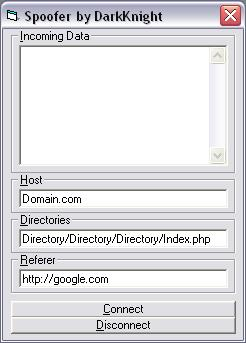



## User Agent Fake Referer OS Spoofer

### Description

*Udated: July 26th 2003* This code allows you to spoof your user-agent (e.g. Internet Explorer), OS (e.g. Linux), and change the referer to anything you want (e.g. google.com). Now, why do this? Simple, to pass protection.
 
### More Info
 

             |
---                |---
**Submitted On**   |2003-07-26 20:01:30
**By**             |[DarkKnightH20](https://github.com/Planet-Source-Code/PSCIndex/blob/master/ByAuthor/darkknighth20.md)
**Level**          |Beginner
**User Rating**    |5.0 (10 globes from 2 users)
**Compatibility**  |VB 5\.0, VB 6\.0
**Category**       |[Miscellaneous](https://github.com/Planet-Source-Code/PSCIndex/blob/master/ByCategory/miscellaneous__1-1.md)
**World**          |[Visual Basic](https://github.com/Planet-Source-Code/PSCIndex/blob/master/ByWorld/visual-basic.md)
**Archive File**   |[User\_Agent1620497262003\.zip](https://github.com/Planet-Source-Code/darkknighth20-user-agent-fake-referer-os-spoofer__1-47104/archive/master.zip)

